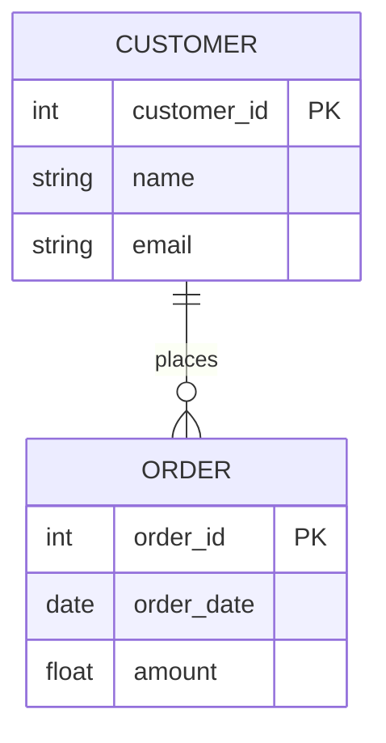
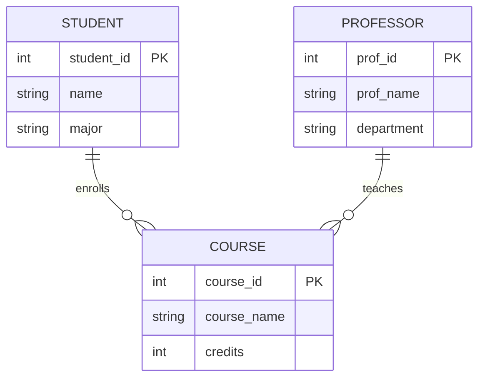

# Slide 1: Introduction
Welcome to **Teaching ER Diagrams**!  
This Slidev presentation will help you understand Entity-Relationship (ER) Diagrams.

---

# Slide 2: Outline
1. What is an ER Diagram?
2. Key Concepts (Entities, Attributes, Relationships, Cardinalities)
3. Example Diagrams (using Mermaid)
4. Normalization
5. Real-World Use Cases
6. Q&A

---

# Slide 3: What is an ER Diagram?
**Definition:**  
An ER Diagram is a visual representation of entities (objects or concepts), their attributes, and relationships between them in a database.

**Purpose:**  
- Helps plan a **database structure**  
- Ensures **data integrity** and **consistency**  
- Simplifies communication among team members

---

# Slide 4: Key Concepts
1. **Entity**: An object or concept (e.g., `Student`, `Order`).
2. **Attribute**: Properties describing an entity (e.g., `Name`, `Date`).
3. **Relationship**: Connections between entities (e.g., `enrolls`, `places`).
4. **Cardinality**: Describes how many entities can be related (`1:1`, `1:N`, `M:N`).

---

# Slide 5: Entities
- **Represent real-world objects** like `Customer`, `Product`, or `Department`.
- Each entity typically **translates to a table** in a relational database.
- **Example**: A `Customer` entity might have attributes such as `CustomerID`, `Name`, and `Email`.

---

# Slide 6: Attributes
- **Describe an entity’s details** (e.g., `FirstName`, `LastName`, `DOB`).
- Attributes can be:
  - **Primary Key (PK)**: Uniquely identifies a record.
  - **Foreign Key (FK)**: Points to a primary key in another entity.
  - **Composite Key**: Combined attributes acting as a unique identifier.

---

# Slide 7: Relationships
- **Link between two or more entities**.
- Examples:
  - **1:1** → One entity relates to one other entity.
  - **1:N** → One entity relates to many others.
  - **M:N** → Many entities relate to many others (requires a bridging table in most DB systems).

---

# Slide 8: Cardinalities
**Notation Examples**:
- **1:1**: A `Person` has **one** `BirthCertificate`.
- **1:N**: A `Teacher` can teach **many** `Courses`.
- **M:N**: A `Student` can enroll in **many** `Courses`, and a `Course` has **many** `Students`.

---

# Slide 9: Simple ER Diagram Example

- **CUSTOMER** places **ORDER**.
- A single customer can place many orders (`1:N`).

---

# Slide 10: More Complex Example

- **STUDENT** enrolls in **COURSE**.
- **PROFESSOR** teaches **COURSE**.

---

# Slide 11: Special Relationship Types
1. **Recursive Relationship**: An entity is related to itself (e.g., an employee manages other employees).
2. **Ternary Relationship**: Three entities participate in a single relationship (less common in practice).

---

# Slide 12: Normalization
- **1st Normal Form (1NF)**: No repeating groups, all columns are atomic.
- **2nd Normal Form (2NF)**: Must be in 1NF + no partial dependency on a composite PK.
- **3rd Normal Form (3NF)**: Must be in 2NF + no transitive dependency.

**Goal**: Minimize redundancy and improve data integrity.

---

# Slide 13: Real-World Use Case
- **E-Commerce Website**:
  - Entities: `User`, `Order`, `Product`, `Payment`, `Review`
  - Relationships:
    - `User` places `Order`
    - `Order` includes `Product`
    - `User` writes `Review` for a `Product`
- **ER Diagrams** help clarify how each piece of data is stored and referenced.

---

# Slide 14: Best Practices
1. **Name Entities Clearly** (singular nouns, e.g., `Student`).
2. **Identify Primary Keys** for each entity.
3. **Use Foreign Keys** to link related entities.
4. **Avoid M:N** relationships without a join table.
5. **Normalize** your design to reduce anomalies.

---

# Slide 15: Conclusion & Next Steps
- ER Diagrams are essential for **planning databases**.
- Mermaid + Slidev provide a **powerful way** to visualize relationships.
- **Next Steps**:
  - Experiment with more complex relationships.
  - Apply **normalization** rules to keep data clean.
  - Explore advanced topics (e.g., **inheritance**, **subclassing** in ER models).

Thank you for learning about **ER Diagrams**! 